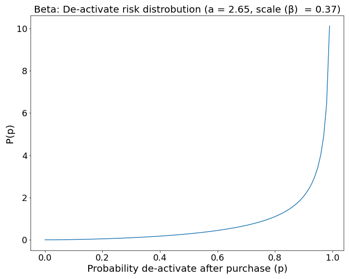
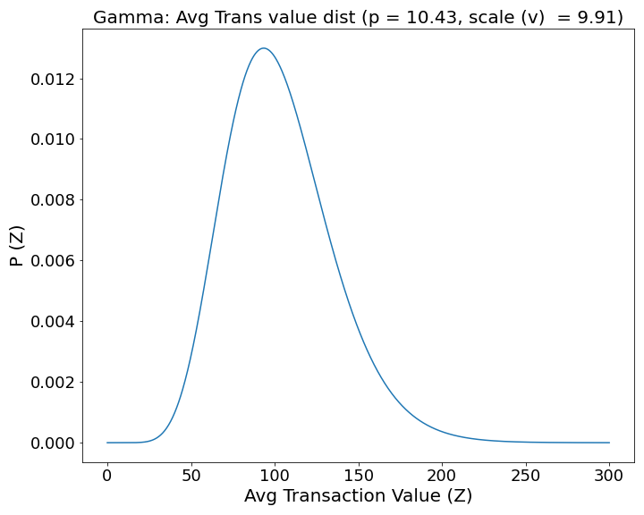

# Windjammer Consulting: Customer Lifetime Value Engine

**Author**: [Alex FitzGerald](https://www.linkedin.com/in/alex-fitzgerald-0734076a/)


## Overview
This project creates a user-friendly customer lifetime value (CLV) prediction engine able to take in transaction data and return important CLV predictions with a high degree of accuracy for a merchant's entire customer base and individual customers over a selected period of time in the future. The data processing and modeling techniques were validated on a publicly available e-commerce data set from Olist but the app is flexible enough to re-process and model unstructured transaction data from any non-contractual business with continuous purchasing behavior (ex. grocery purchases, e-commerce, movie rentals).

## Business Problem
How much are your customers worth? CLV is a north star metric for marketers and key to many business analyses; sales/marketing activity ROI, sales forecasts, company valuation, churn mitigation tactics, and customer persona analysis. 

Olist, the largest e-commerce department store in Brazil, wants to help the small business merchants who sell goods through their marketplace understand their CLV. Olist makes their money taking a commission on orders placed on their marketplace. They want to help their merchants sell more products and retain those merchants on their marketplace by providing top-notch business analytics.

Olist has decided to create a user friendly app to help their merchants better understand the customers who buy their products through the Olist marketplace. Empowering their merchants with CLV analysis will help merchants improve their strategy and increase sales and commissions through Olist. The addition of a customer insight tool will also improve the retention of merchants on the Olist network. 

To accomplish this project, Olist has hired Windjammer Consulting, a data-science consulting firm.

To test out the app for accuracy, Olist has provided a full transaction data set of purchases from all vendors and asked Windjammer Consulting to return CLV predictions with minimal error (RMSE).
If the model passes muster, they want Windjammer Consulting to create an application that allows merchants to upload their own data and retrieve predictions.

## Data

The data for this project was sourced from a [Olist database provided to Kaggle](https://www.kaggle.com/datasets/olistbr/brazilian-ecommerce) containing information on 99,441 online transactions from 96,096 unique customers. Transactions included in the data ranged 773 days, from 2016-09-04 to 2018-10-17.

Joining files from the database created a data frame where rows correspond to unique transactions with the necessary features for CLV modeling; a unique customer identifier, transaction time-stamp, and the monetary value of the transaction.

Less than 3% of customers in the data ordered more than once which created a significant class imbalance for the modeling techniques used. In a business setting, the 3% repurchase rate is very low. Despite the class imbalance the model was able to achieve very accurate predictions for the number of purchases in the future. The class imbalance could pose more of an issue predicting monetary value. I validated that the monetary value model was highly accurate on a small subset of the data that provided transactions in multiple periods. Given the constraints of a time based train and test split, I wasn’t able to validate the model on the 97% of users who only purchased once. To deal with the class imbalance, you could subset the data to include only users who purchased more than once but with the goal of producing a scalable app that works for most businesses, I decided to include all customers. I assumed that most businesses don't have this degree of class imbalance and managers will prefer to return predictions for all their customers.


## Methods
CLV is the present value of all future cash flows of a current customer. Given the application of the model, calculating the value of a customer n periods into the future, we'll estimate a customer's probability of being alive n periods of time in the future and use this parameter to discount the product of frequency and monetary value of their purchases. Thus the formula becomes CLV at time T = (Transactions per Period X Average Value Per Transaction X Probability of Being Active at Time T).

Many CLV formulas will also consider margin in the calculations. For the purposes of this project, because I didn't have access to product margin information I didn't include it. 

I used a hierarchical modeling approach to estimate each of these three elements of CLV. This approach combines the BG/NBD model as proposed by [Fader, Hardie and Lee](http://www.brucehardie.com/papers/bgnbd_2004-04-20.pdf) with a Gamma-Gamma model of monetary value proposed by [Fader and Hardie] in follow up to their work on the BG/NBD model. Data preparation and modeling was done with the Lifetimes package [Copyright 2015, Cameron Davidson-Pilon](https://lifetimes.readthedocs.io/en/latest/). 

### Data preparation with Lifetimes
The BG/NBD and Gamma-Gamma model fitters in Lifetimes require data structured into a [recency-frequency-monetary_value matrix](https://lifetimes.readthedocs.io/en/latest/Quickstart.html#the-shape-of-your-data). Helpfully, the package provides utility functions for easily transforming raw transaction data into the required format with these features.
- Index (ID): unique customer identifier (unique to table)
- Frequency: represents the number of repeat purchases the customer has made.
- T: age of the customer in whatever time units chosen (days in this project). This is equal to the duration between a customer’s first purchase and the end of the period under study.
- Recency: age of the customer when they made their most recent purchases. This is equal to the duration between a customer’s first purchase and their latest purchase.
- Monetary_value: represents the average value of a given customer’s purchases. This is equal to the sum of all a customer’s purchases divided by the total number of purchases.

###  Beta Geometric Negative Binomial Distribution (BG/NBD) Model

***Features***
- Model to estimate **Probability of being active at time T** and **Expected number of transactions at time T**
- Using Frequency, T, and Recency features, each unique customer is assigned x, t_x, T values where x is the number of transactions at some period of time (0, T], and t_x (<=T) is the time of the last purchase.

***Latent Features***
- p = probability customer de-activates after purchase
  - a = shape parameter for dist of p
  - β = scale parameter for dist of p 
- λ = transaction rate
  - α = shape parameter for dist of λ
  - r = scale parameter for dist of λ
- μ = customer lifetime (slope of the exponential dist.)

***Assumptions***
- After each transaction, an individual has a p_i probability of de-activating
- Each individual, i, has a hidden transaction per period rate (λ_i) and probability of de-activating following a purchase (p_i)
- Individual λ_i and p_i parameters are constrained by population wide Gamma and a Beta distribution respectively
- Individuals purchases follow a Poisson process with rate λ_i*t

***Formulas***
Probability of Being Active |  Expected Number of Transactions
:-------------------------:|:-------------------------:
|  

**Gamma gamma model (GG)**

***Features***
- Used to estimate **Average Value Per Transaction**
- Takes Frequency and Monetary_value features to create observed features x and mx respectively

***Latent Features***
- E(M) = avg transaction value of purchases in the future
  - p = shape parameter for dist of E(M)
  - v = scale parameter for dist of E(M)

***Assumptions***
- Monetary value of users’ transactions is random around their mean transaction value.
- Mean transaction value varies across users but doesn’t vary for an individual user over time.
- Mean transaction values is Gamma distributed across customers.

***Formula***
Average Value Per Transaction


## Results
**BG/NBD Model** 

The model was very accurate at predicting the number of purchases customers would make in the future. We improved upon our dummy model because the model doesn't suffer from the naive assumption that purchase rate will just continue as observed in the past. It's interesting to note that the gap in performance between the BG/NBD model and dummy approach was greater when data was subsetted to repeat purchasers (0.82 hierarchical vs 0.50 dummy). A naive assumption that no repeat purchases in the observation period would lead to no purchases in the test period was accurate very often given our the class imbalance of the full data. This advantage for the dummy model is removed when the data is subsetted or the model is presented with business data that is less imbalanced. It's encouraging to know this modeling technique will work even better when applied to most merchants.

- Final Model: 0.14 RMSE (transactions)
- Dummy Model: 0.19 RMSE (transactions)

Dummy Model             |  BG/NBD Model
:-------------------------:|:-------------------------:
  |  


**GG Model**
!ADD MORE DETAIL HERE!
- Final Model: 6.63 RMSE (average transaction value)
- Dummy Model: 192.78 RMSE (average transaction value)

**Combined Results**

Cumulative CLV             |  CLV Distribution
:-------------------------:|:-------------------------:
  |  

**Latent Model Features**
Heterogeneity: Purchase Rate              |  Heterogeneity: De-activate Risk |  Heterogeneity: Transaction Value
:-------------------------:|:-------------------------:|:-------------------------:
  |   |  

Latent features: Purchase Rate  |  Latent features: De-activate Risk| Latent features: Transaction Value
:-------------------------:|:-------------------------:|:-------------------------:
shape (α) = 46.46, scale (r) = 0.01<br>With frequency measured in days, it's not suprising that entire customer base is between 0-1 purchases per day.|shape (a) = 2.65, scale (β) = 0.37<br>With so many of our customers only purchasing 1x, we'd expect to see this beta discribution heavily skewed toward the right as it is here. This shape indicates that the majority of our customer base is at high risk of being de-active right now.|shape (p) = 10.43, scale (v) = 9.91<br>As expected, our distribution begins above 0 and is right skewed because of a small number of very large purchases. The bulk of purchases are clustered around 100 monetary value.

**Streamlit App**
App Details             |  App Preview
:-------------------------:|:-------------------------:
Live [Streamlit App](https://zander1268-custorama-streamlitwindjammer-clv-engine-jlp5js.streamlitapp.com/) capable of reproducing the above results as well as taking in new transaction data and returning CLV predictions. Using the same [data file](data/lifetimes_object_df.csv) and regularization strength used in my [Jupyter notebook](final_bg_nbd_modeling.ipynb) I was able to replicate the same clv results using the streamlit app. Additionally, the app took in new transaction data from a different business and was able to successfully process, clean and model CLV predictions demonstrating its flexibility. |  

## Limitations & Next Steps
**Margin**

Most CLV formulas hold for product margin as part of the calculation. Multiplying margin by the other factors produces a customer lifetime *profit*. This project didn't have access to margin information thus it wasn't included.

Future iterations would include margin if that data became available.

**Limited business context applicability**

Applicability limited to non-contractual businesses with continuous purchases. There are other business contexts where this modeling approach is not applicable. [Breakdown of Olist business context](https://github.com/zander1268/custorama/blob/main/visuals/business_context.jpg?raw=true).

Future iterations of the model could be altered to better suit different business contexts.

**Limited number of repeat customers***

Because Gamma Gamma model fitters do not accept zero values in freq and monetary values, I had to fit and validate on the limited subset of users with a repeat purchases. Given the class imbalance this is a limited group. Ideally, there would be more data that included a greater number of repeat purchasers to help better validate gamma gamma model and demonstrate the performance of BG/NBD model over the dummy model.

## Conclusion

This project successfully created a user-friendly CLV prediction engine and validated it's performance on real world transactional data from Olist with minimal error. The app is built on the same data processing and modeling techniques as the validated model but is capable of taking in unstructured and unseen data from new merchants and returning important CLV predictions. The app will empower merchants to make better decisions and delight customers. It opens the door to a number of business analyses; marketing ROI, sales forecasts, company valuation, churn risk, and persona analysis. Olist can quickly roll out this tool to it's e-commerce merchants and enjoy greater commissions and retention rate.


 
## For More Information

See the full analysis in the [Jupyter Notebook](./Code/modeling.ipynb) or review this [presentation](./Churn_Buster_presentation.pdf).

For additional info, contact Alex FitzGerald

## Repository Structure

```
├── Code
│   ├── EDA_notebook.ipynb
│   ├── modeling.ipynb
├── Data
│   ├── churn-in-telecoms-dataset.csv
│   ├── cleaned_data.csv
│   ├── feature_importances.csv
├── Visuals
├── Churn_Buster_presentation.pdf
└── README.md
```
