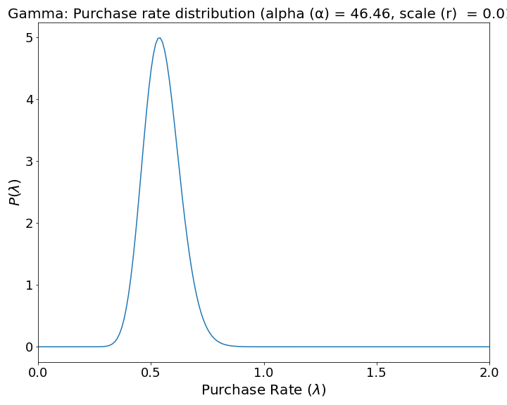
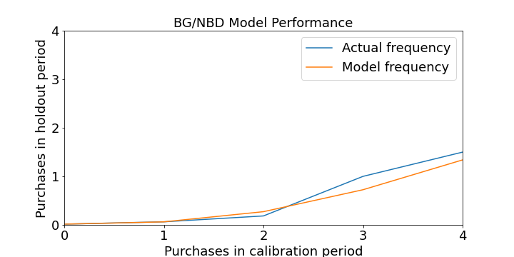

# Windjammer Consulting: Customer Lifetime Value Engine

**Author**: [Alex FitzGerald](https://www.linkedin.com/in/alex-fitzgerald-0734076a/)


## Overview
This project creates a user-friendly customer lifetime value (CLV) prediction engine able to take in transaction data and return important CLV predictions for the merchant's entire customer base or individual customers over a selected period of time in the future.

## Business Problem
How much are your customers worth? CLV is a north star metric for marketers and key to many business analyses; sales/marketing activity ROI, sales forecasts, company valuation, churn mitigation tactics, and customer persona analysis. 

Olist, the largest e-commerce department store in Brazil, wants to help the small business merchants who sell goods through their marketplace undrstand their CLV. Olist makes their money taking a commision on orders placed on their marketplace. They want to help their merchants sell more products and retain those merchants on their marketplace by providing top-notch business analytics.

Olist has decided to create a user friendly app to help their merchants better understand the customers who buy their products through the Olist marketplace. Empowering their merchants with CLV analysis will help merchants improve their strategy and increasing sales and commisions through Olist. The addition of a customer insight tool will also improve the retention of merchants on the Olist network. 

To accomplish this project, Olist has hired Windjammer Consulting, a data-science consulting firm.

To test out the app for accuracy, Olist has provided a full transaction data set of purchases from all vendors and asked Windjammer Consulting to return CLV predictions with minimal error (RMSE).
If the model passes muster, they want Windjammer Consulting to create an application that allows merchants to upload their own data and retrieve predictions.

## Data

The data for this project was sourced from a [Olist data base provided to Kaggle](https://www.kaggle.com/datasets/olistbr/brazilian-ecommerce) containing information on 99,441 online transactions from 96,096 unique customers. Transactions included in the data ranged 773 days, from 2016-09-04 to 2018-10-17.

Joining files from the data base created a dataframe where rows corresponded to unique transactions with the necessary features for CLV modeling; a unique customer identifier, transaction time-stamp, and the monetary value of the transaction.


## Methods
CLV is the present value of all future cash flows of a current customer. Given the application of the model, calculating the value of a customer n periods into the future, we'll estimate a customer's probability of being alive n periods of time in the future and use this parameter to discount the product of frequency and monetary value of their purchases. Thus the forumla becomes CLV at time T = (Transactions per Period X Average Value Per Transaction X Probability of Being Active at Time T).

I used a heirarchical modeling approach to estimate each of these three elements of CLV. This approach combines the BG/NBD model as proposed by [Fader, Hardie and Lee](http://www.brucehardie.com/papers/bgnbd_2004-04-20.pdf) with a Gamma-Gamma model of monetary value proposed by [Fader and Hardie] in follow up to their work on the BG/NBD model. Data preparation and modeling was done with the Lifetimes package [Copyright 2015, Cameron Davidson-Pilon](https://lifetimes.readthedocs.io/en/latest/). 

**Data preperation with Lifetimes**
The BG/NBD and Gamma-Gamma model fitters in Lifetimes [require data structured into a recency-frequency-monetary_value matrix](https://lifetimes.readthedocs.io/en/latest/Quickstart.html#the-shape-of-your-data). Helpfully, the package provides utility functions for easily transforming raw transaction data into the required format.
- Index (ID): unique customer identifier (unique to table)
- Frequency: represents the number of repeat purchases the customer has made.
- T: age of the customer in whatever time units chosen (days in this project). This is equal to the duration between a customer’s first purchase and the end of the period under study.
- Recency: age of the customer when they made their most recent purchases. This is equal to the duration between a customer’s first purchase and their latest purchase.
Monetary_value: represents the average value of a given customer’s purchases. This is equal to the sum of all a customer’s purchases divided by the total number of purchases.

**Beta geometric negative binomial distribution (BG/NBD) model**
- Used to estimate **Probability of Being Active at Time T** and **Transacitons per Period**
- After each transaction, an individual has a p_i probability of de-activating (never buying again)
- Each individual, i, has a hidden transaction per period rate (lambda_i) and probability of de-activating following a purchase (p_i)
- Individual lambda_i and p_i parameters are constrained by population wide Gamma and a Beta distribution respectively
- Individuals purchases follow a Poisson process with rate lambda_i*t 

**Gamma gamma model (GG)**
- Used to estimate **Average Value Per Transaction**
- For any given customer, total spend across x transactions is distributed gamma

Heterogeneity: Purchase Rate              |  De-activate Risk |  Transaction Value
:-------------------------:|:-------------------------:|:-------------------------:
  |   |  

## Results
**BG/NBD Model** 
- Final Model: 0.14 RMSE (transactions)
- Dummy Model: 0.82 RMSE (transactions)

Dummy Model             |  BG/NBD Model
:-------------------------:|:-------------------------:
  |  


**GG Model**
- Final Model: 6.63 RMSE (average transaction value)
- Dummy Model: 192.78 RMSE (average transaction value)

**Combined Results**

Cumulative CLV             |  CLV Distribution
:-------------------------:|:-------------------------:
  |  


Live [Streamlit App](https://zander1268-custorama-streamlitwindjammer-clv-engine-jlp5js.streamlitapp.com/) capable of reproducing the above results as well as taking in new transaction data and returning CLV predictions.

## Conclusions
TBD

### Limitations & Next Steps

TBD

 
## For More Information

See the full analysis in the [Jupyter Notebook](./Code/modeling.ipynb) or review this [presentation](./Churn_Buster_presentation.pdf).

For additional info, contact Alex FitzGerald

## Repository Structure

```
├── Code
│   ├── EDA_notebook.ipynb
│   ├── modeling.ipynb
├── Data
│   ├── churn-in-telecoms-dataset.csv
│   ├── cleaned_data.csv
│   ├── feature_importances.csv
├── Visuals
├── Churn_Buster_presentation.pdf
└── README.md
```
